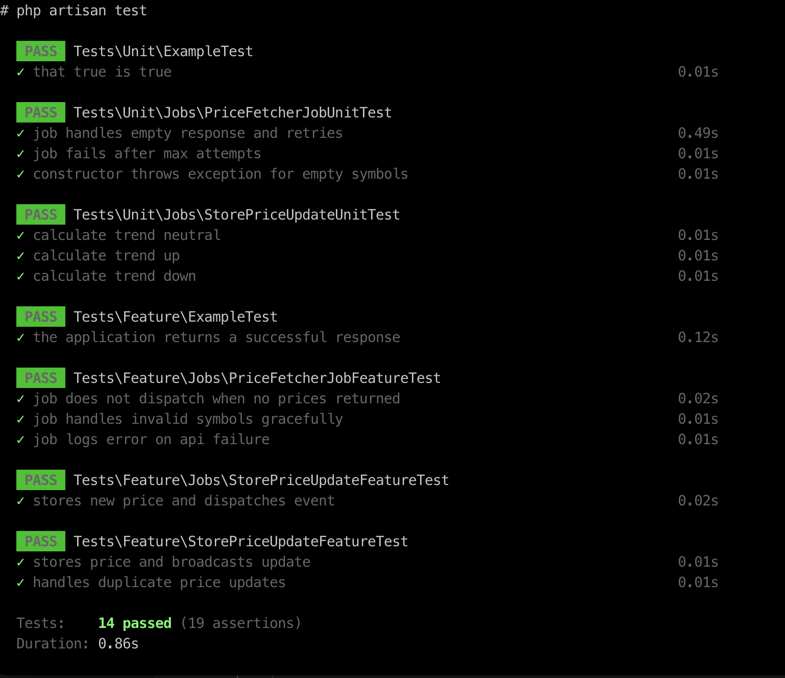

# Upperate - Laravel LiveWire Developer Technical Assessment

## Overview

This project implements a cryptocurrency price aggregation system that fetches and processes real-time prices from multiple exchanges. It provides both WebSocket and REST APIs for real-time data, and utilizes Laravel LiveWire for a dynamic frontend.

## Demo

<video src="./docs/5aae6719-5d83-4709-b565-72b7bfb0f402.webm" width="600" controls></video>


### Features:
- **Price Aggregation**: Fetches the average price of configured cryptocurrency pairs across multiple exchanges at configurable intervals.
- **WebSocket API**: Emits real-time updates when new data is available.
- **REST API**: Returns the last known prices of all configured cryptocurrency pairs.
- **LiveWire Frontend**: Displays real-time data, price changes, and exchange information.
- **Live Digital Clock**: Displays the current time in the user's timezone.
- **Price Change Indicators**: Visual arrows (up or down) indicating price change direction.
- **Error Handling & Caching**: Handles API failures gracefully and caches results where appropriate.

---

## Setup & Execution Instructions

### 1. **Clone the Repository**

```bash
git clone https://github.com/EnnyOlajide/crypto-aggregator.git
cd upperate
```

### 2. **Set up the Environment**

- Rename `.env.example` to `.env`.

```bash
cp .env.example .env
```

- Update the `.env` file with the following values:

```env
CRYPTO_CACHE_TTL=5
CRYPTO_API_TIMEOUT=5
CRYPTO_API_RETRIES=3
CRYPTO_API_RETRY_DELAY=100
CRYPTO_UPDATE_INTERVAL=5
CRYPTO_PAIRS=BTCUSDC,BTCUSDT,BTCETH
CRYPTO_API_KEY=2hz2naj1jgydquw7locs
CRYPTO_EXCHANGES=binance,mexc,huobi
CRYPTO_API_ENDPOINT=https://api.freecryptoapi.com/v1

# Broadcasting Configuration
BROADCAST_DRIVER=reverb
BROADCAST_CONNECTION=reverb
REVERB_APP_ID=256980
REVERB_APP_KEY=f4l2tmwqf6eg0f6jz0mw
REVERB_APP_SECRET=zioqeto9xrytlnlg7sj6
REVERB_HOST=localhost
REVERB_PORT=8000
REVERB_SCHEME=http

# Configure crypto pairs and exchanges
PAIRS="BTCUSDT,BTCETH,ETHUSDT"
EXCHANGES="binance,mexc,huobi"

# API Fetch Interval (in seconds)
CRYPTO_API_FETCH_INTERVAL=5
```

### 3. **Set up Docker**

- Ensure Docker is installed and running.

```bash
docker compose up
```
- This will do everything necessary for complete installation

### 4. **Running the Application**

- Run the application:

```bash
./start.sh
```

 - all dependencies will be installed and tests will be performed
 - Migration all run
 - Configuration caching

### 5. **Start Reverb Server**

- In a new terminal window, start Reverb Server to start dispatching and recieving websocket events

```bash
 php artisan reverb:start 
```

### 6. **Check Project**

- Checkout project on browser

[http:localhost:13579](http:localhost:13579)


## Architecture Overview

The application follows the following structure:

- **Laravel Queue**: Handles the long-running jobs that fetch prices from APIs, using the database as the queue connection.
- **Supervisor**: Manages background jobs to ensure the price fetcher job runs consistently.
- **WebSocket API**: A WebSocket server that emits real-time price updates after new data is processed and saved.
- **REST API**: A standard API that serves the last known prices and exchange information.
- **Laravel LiveWire**: Manages frontend components for real-time data display.
- **Database**: The application uses SQLite for simplicity, storing the prices and exchange data for historical reference.
- **SQLite Database**: The application uses SQLite for simplicity, storing the prices and exchange data for historical        reference. The queue and cache use the database store.
- **Caching**: The results of API calls are cached in the database to reduce load and avoid redundant requests.
-**Broadcasting with Reverb**: The application uses Reverb for broadcasting real-time data updates, configured through the .env settings:
    QUEUE_CONNECTION=database
    CACHE_STORE=database
    BROADCAST_DRIVER=reverb
    BROADCAST_CONNECTION=reverb
    CACHE_DRIVER=database

---


## Retry Mechansim
    Retry Mechanism in FreeCryptoApiClient
    The FreeCryptoApiClient implements an automatic retry mechanism to handle API request failures, ensuring reliability and robustness.

    🔄 How It Works
    Initial Request: Sends an asynchronous API request.
    Failure Handling: If the request fails, it checks if retries are available (max 3 retries).
    Retry Logic: If retries remain, the request is retried with a logged warning.
    Final Failure: If all attempts fail, an error is logged, and an exception is thrown.
    Successful Response: If the request succeeds, the response is validated and processed.

        Start Request  
            │  
            ▼  
        API Request 🔄  
            │  
            ▼  
        Response Success? → ✅ Yes → Process Response  
            │  
            ❌ No  
            │  
            ▼  
        Retry Available? → ✅ Yes → Log & Retry  
            │  
            ❌ No  
            │  
            ▼  
        Log Error & Throw Exception 🚨  


✅ Benefits
    Improved Reliability: Retries reduce temporary failures.
    Better Debugging: Logs track failed attempts.
    Asynchronous Execution: Ensures multiple requests run efficiently.

## Design Decisions & Trade-offs

- **Price Fetching in Parallel**: Prices are fetched asynchronously from multiple exchanges to ensure accuracy and speed.
- **Real-Time Updates**: WebSockets are used for real-time communication between the backend and frontend.
- **Caching**: The results of API calls are cached to reduce load and avoid redundant requests.
- **Error Handling**: Comprehensive error handling ensures failures are logged and re-attempted up to a set number of tries.
- **Use of LiveWire**: LiveWire is used for seamless interactivity without requiring complex JavaScript for updating the frontend.
  
---

## Known Issues or Limitations

- **API Rate Limits**: Some exchanges may have rate limits that could impact the frequency of data fetching.
- **Cross-Browser Compatibility**: The WebSocket API may face connectivity issues with certain browsers if network fluctuations occur.

---

## Possible Improvements

- **Improve UI/UX**: Add more visual effects, animations, and transitions to the frontend for a more engaging user experience.
- **Automate API Fetch Intervals**: Allow users to dynamically configure the fetching intervals through the frontend.
- **Scaling**: The application could be scaled horizontally by using multiple workers and load balancers if traffic increases.

---

## Testing

Unit tests are implemented for core functionality. To run the tests:

```bash
   php artisan test
```



---

## CI/CD Implementation

The project is integrated with **GitHub Actions** for continuous integration and deployment. It includes:

- Building the project.
- Running unit tests.
- Deploying the application to the production environment upon successful tests.

---

## Docker Setup

### Running in Docker:

The application uses Docker for an isolated environment. To run everything in Docker:

1. Ensure Docker is installed.
2. Build and start the services using:

```bash
./start.sh
```

---

## License

This project is open source and available under the [MIT License](LICENSE).
